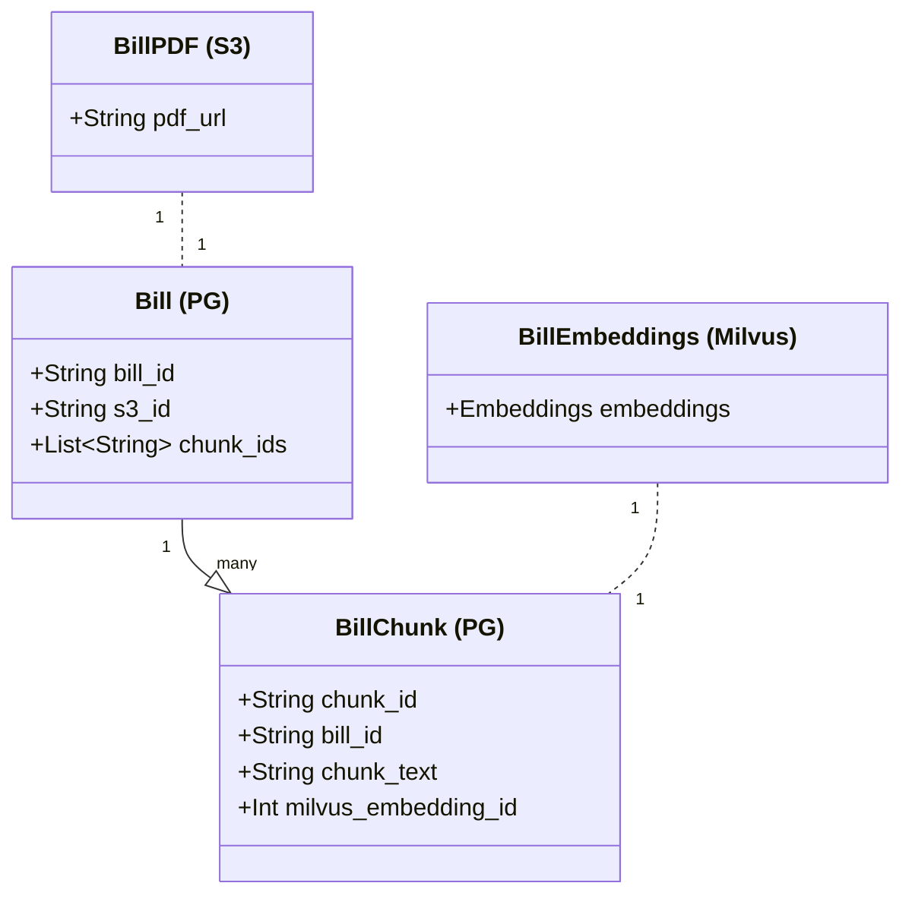

```mermaid
classDiagram
    class BillPDF["BillPDF (S3)"] {
        +String pdf_url
    }
    class BillEmbeddings["BillEmbeddings (Milvus)"] {
        +Embeddings embeddings
    }
    class Bill["Bill (PG)"] {
        +String bill_id
        +String s3_id
        +List~String~ chunk_ids
    }
    class BillChunk["BillChunk (PG)"] {
        +String chunk_id
        +String bill_id
        +String chunk_text
        +Int milvus_embedding_id
    }

    BillPDF "1" .."1" Bill
    Bill "1" --|> "many" BillChunk
    BillEmbeddings "1" .. "1" BillChunk

```
